# 架构总览：内核、服务、分层与企业仓库边界

本文定义 `ditto-llm` 在未来一段时间内的实际产品边界、仓库边界和默认支持面。

这不是“长期愿景清单”，而是用于约束实现范围的架构文档。
本文也是当前唯一的主架构文档；此前分散的 DDD 评估内容已经并入本文。

## 状态

已接受，作为近期架构收敛方向。

## 一句话决策

`ditto-llm` 应聚焦 **L0 模型调用与协议转化内核** 和 **L1 LiteLLM-like 服务层**。

企业级闭环能力不应继续塞进本仓库，而应放到一个**独立的 L2 仓库**中，通过稳定契约复用 `ditto-llm` 的能力。

## 架构方法

`ditto-llm` 不应走“全仓库 DDD 重写”路线。

更合理的方法是：

- 顶层采用模块化单体 + 明确分层，
- provider 侧采用 ports-and-adapters / anti-corruption layer，
- `runtime` 只负责能力装配、路由决策和跨 provider 的统一语义，
- `gateway` 只负责常见服务能力与控制面，
- 只有真正包含稳定策略和不变量的部分，才做定向领域建模。

因此：

- DTO 不要伪装成领域对象，
- provider 适配逻辑不要提升成共享领域模型，
- 企业治理逻辑不要提前倒灌进 L0/L1 内核。

## 核心层级与核心领域

### 核心层级

`ditto-llm` 的核心层级应分成三类。

1. 核心内核层

- `foundation`
- `contracts`
- `llm_core`

职责：

- 提供底层支撑、共享 contract、统一调用抽象。

2. 核心装配层

- `catalog`
- `config`
- `providers`
- `runtime`

职责：

- 接收配置，
- 描述支持真相，
- 对接 provider，
- 产出统一 runtime route 和转化结果。

3. 服务与工作流层

- `sdk`
- `gateway`
- `agent`

职责：

- 面向开发者提供产品表层，
- 暴露服务，
- 组织更高层工作流。

### 核心领域

`ditto-llm` 没有一个覆盖全仓库的单一业务领域。

真正的核心领域只有两个：

1. 运行时能力装配与路由决策

- 主体在 `runtime`
- 依赖 `catalog`、`config`、`providers`
- 负责决定某个请求最终走什么 surface、什么 provider、什么能力组合

2. 网关控制面策略

- 主体在 `gateway/domain` 与 `gateway/application`
- 负责 limits、budgets、routing、observability 等常见服务策略

以下内容不是核心领域：

- `providers` 是 adapter / ACL，
- `foundation` 是底层支撑，
- `llm_core` 是抽象内核，
- `sdk` / `agent` 是产品和工作流层。

## 仓库分层

### L0：模型调用与转化内核（本仓库）

L0 的职责只有两类：

- 调用不同模型 / provider 的原生接口，
- 在不同接口之间做协议转化与语义归一。

L0 不负责企业治理，不负责重型控制面，不负责组织级工作流。

### L1：服务层（本仓库）

L1 在 L0 之上提供一个可部署服务，能力边界对标 LiteLLM 的常见使用路径，而不是完整企业平台。

L1 的职责是：

- 暴露常见 server 能力，
- 提供 OpenAI-compatible 服务入口，
- 提供常见的路由、预算、限流、观测、存储等控制面能力，
- 让中小团队或中型团队可以直接落地使用。

### L2：企业平台层（独立仓库）

L2 应该是一个额外仓库。

它复用 `ditto-llm` 的 L0/L1 能力，但自己承载完整企业能力，例如：

- 组织 / 项目 / 租户治理，
- 完整 RBAC / SSO / SCIM，
- 审批流与策略编排，
- 企业级计费、对账、审计闭环，
- Prompt / Eval / Agent Eval / 治理平台。

L2 可以依赖 `ditto-llm`，`ditto-llm` 不能反向依赖 L2。

## 近期默认支持面

近期不追求“海量 provider + 全能力面”，而是先把最关键的调用和转化做稳。

### 近期必须支持的原生接口

近期一等支持的原生接口应收敛为：

- OpenAI `chat.completions`
- OpenAI `responses`
- Gemini 普通原生接口（即 `generateContent` 这一类）
- CC 普通原生接口

当前代码与配置口径中，如果 CC 对应 Claude / Anthropic，则应落在 `anthropic_messages` 这条 native surface 上。

### 近期必须支持的公共转化目标

所有已接入模型，近期都至少应支持投影到：

- OpenAI `chat.completions`

这意味着：

- `chat.completions` 是近期最重要的公共互操作接口，
- 它是 gateway translation 的核心目标面，
- 它也是“不同模型统一暴露给上层”的最小公共表面。

### `responses` 的定位

`responses` 近期仍然是一等支持面，但它的定位与 `chat.completions` 不同。

应采用以下原则：

- OpenAI `responses` 作为官方一等 surface 保留，
- 不要求所有 provider 都先实现原生 `responses` 语义，
- 跨 provider 的最小公共转化目标优先对齐到 `chat.completions`，
- `responses` 可以通过 native support 或 best-effort shim 提供。

换句话说：

- **公共互操作面** 优先是 `chat.completions`
- **更强表达能力的官方接口** 是 `responses`

不要把所有 provider 都强行拉到 `responses` 作为统一最低接口。

## L0 应该如何设计

L0 的核心不是“支持多少 provider”，而是“能否稳定调用与转化”。

### L0 的核心抽象

L0 应该围绕下面几件事设计：

- provider-agnostic 的调用请求与响应抽象，
- tool call / usage / finish reason / warning 等统一语义，
- 原生 surface 到内部 contract 的映射，
- 内部 contract 到 OpenAI `chat.completions` 的映射，
- 必要时对 `responses` 做一等实现或 shim。

### L0 不应承担的职责

L0 不应承担：

- 组织 / 项目 / 租户治理，
- 企业级审计闭环，
- 审批流，
- 配置中心，
- 复杂权限模型，
- 重型运营后台逻辑。

这些都不是“模型调用与协议转化内核”的职责。

### L0 还必须具备 AI-native 能力

这里的 “AI-native” 不是指在 L0 里塞一个智能体框架，而是指：

- L0 的接口、错误、能力声明和运行时元信息，必须天然适合被 AI 程序消费，
- L0 不只是“给人写 SDK”，而是“让模型、agent、自动化系统也容易理解和调用”。

L0 至少应满足下面几条。

1. machine-first contract

- 所有核心输入输出都应尽量结构化，
- tool call、usage、warning、finish reason、stream event、session metadata 都要有稳定字段，
- provider 差异要通过统一 contract + 明确扩展位表达，而不是把隐式语义藏在注释里。

2. 自描述能力

- L0 应能回答“我支持什么”这类问题，
- 包括 surface、模型能力、多模态支持、streaming/realtime 能力、tool 能力、结构化输出能力，
- 这些信息应通过 `catalog` / 兼容性矩阵 / runtime 能力注册表对外暴露成稳定的机器可读结果。

3. 可解释的运行时决策

- 当 `runtime` 选择了某个 surface、provider 或转化路径时，
- 应该能产出最小但稳定的 explain 信息，
- 让上层 AI 或自动化系统知道“为什么这样选”“因为哪些能力约束没走另一条路径”。

4. 原生特性逃生舱

- 统一 contract 不能退化成最低公约数陷阱，
- 应保留 provider-specific structured options 和 raw passthrough 双轨机制，
- 让 AI 调用方在明确声明时，可以无损使用厂商原生能力。

5. 流式与会话语义必须机器友好

- 流不应只被当成字符串片段，
- text/audio/video/tool/frame 等事件需要清晰的事件边界和语义标签，
- realtime / websocket / webrtc 相关协商结果，也应以稳定 session 描述对外呈现。

一句话说：

- L0 要做成“对人清晰、对 AI 更清晰”的调用内核，
- 而不是“只能靠人读文档猜语义”的协议胶水层。

## L1 服务层应如何设计

L1 的定位是：

- 一个可部署的模型服务，
- 一个 LiteLLM-like 的常见 server，
- 一个面向常见团队场景的控制面，
- 但不是完整企业平台。

L1 应优先做成**低运维复杂度的模块化单体服务**，而不是一开始拆成很多服务。

原因很简单：

- 近期核心问题是把模型调用、协议转化、常见 server 能力做稳，
- 不是追求企业级控制面拆分，
- 也不是把每个能力都做成独立系统。

### L1 的内部架构

L1 建议按下面四层组织。

1. 北向接口层

- OpenAI-compatible HTTP API，
- SSE / streaming 输出，
- `health` / `ready` / 基础管理端点，
- 基础请求校验、trace 透传、错误归一。

2. 服务应用层

- API key 鉴权，
- model alias / route policy，
- budgets / limits / timeout / retry，
- 请求级 observability 和 usage 记录，
- 对上层暴露统一的服务语义。

这一层的核心载体就是 `gateway`。

3. Runtime bridge 层

- 把北向请求转成 `runtime` 可消费的统一调用，
- 触发 route 解析、provider 选择、surface 转化，
- 组织 streaming、tool call、warning、usage 等统一输出。

4. 数据与运维支撑层

- SQLite / Postgres 持久化，
- key、budget、route policy、usage event、request log 等服务态数据，
- metrics / logs / traces / export 等运维支撑。

这四层仍然应实现为一个清晰分层的服务进程。
不要在 L1 内部再形成“网关依赖企业治理、企业治理再反向塑造网关”的循环结构。

### L1 还必须具备 AI-native 运维能力

L1 不只是 northbound API 的承载层，也应该是一个便于 AI 使用、便于 AI 运维的服务层。

这里的目标不是让 L1 直接变成“自治运维 agent 平台”，而是让它具备：

- 被 AI 调用，
- 被 AI 诊断，
- 被 AI 审核变更，
- 被 AI 安全地执行有限运维动作，

所需的最小机器友好表面。

L1 至少应满足下面几条。

1. machine-first admin / ops surface

- 健康检查、模型列表、配置快照、策略状态、缓存状态、usage 汇总、最近错误样本，
- 都应优先通过稳定 JSON 接口暴露，而不是只通过 UI 或日志文本暴露，
- 错误码、原因码、对象 ID、版本号、trace id 应稳定可解析。

2. explain / dry-run / simulate

- 路由、策略、预算、降级决策不应是黑盒，
- L1 应尽量提供 explain 或 dry-run 能力，
- 让 AI 可以在不真正发请求、不真正改配置的情况下回答：
- “这次请求会走哪条路由”
- “哪条 guardrail 会命中”
- “为什么被拒绝”
- “如果切换配置版本会发生什么”

3. 声明式控制面

- L1 更适合接收版本化快照、声明式配置和只读镜像，而不是接受大量临时命令式写操作，
- 这样 AI 运维系统可以围绕 diff、plan、apply、rollback 组织动作，
- 也更容易做审批、审计和回滚。

4. 适合自动化审计

- usage、cache hit、拒绝原因、熔断事件、回退路径、provider 错误类别，
- 应形成结构化事件流或结构化导出，
- 让 AI 可以自动做异常归因、容量分析、成本分析和策略建议。

5. 安全可委托

- 给 AI 用的运维接口必须是受限的，
- 应支持 scoped token、只读权限、审批前置、幂等操作、变更原因和审计留痕，
- 不能把“管理员全权写接口”直接当作 AI-native 能力。

6. 面向 AI 的文档与协商信息

- API schema、能力矩阵、字段约束、配置结构、错误码说明，
- 应尽量保持机器可读，
- 这样 L1 才真正适合被 IDE agent、运维 agent、测试 agent、评估 agent 使用。

这类能力的核心意义是：

- 让 L1 不只是“提供一个 HTTP 代理”，
- 而是“提供一个可被程序化理解和操作的 AI Gateway”。

### L1 必须提供的具体功能

近期应优先做稳这些能力：

- `health` / `ready` / 基础管理端点，
- `GET /v1/models`
- `POST /v1/chat/completions`
- `POST /v1/responses`
- provider routing
- key-based auth
- 基础 budgets / limits
- 基础 observability
- 基础 proxy / translation 路径

如果再细化一层，L1 近期至少要覆盖下面几组能力。

1. 协议入口能力

- OpenAI-compatible `chat.completions`，
- OpenAI-compatible `responses`，
- 统一错误码和流式输出语义，
- 对外隐藏不同 provider 的细节差异。

2. 路由与策略能力

- 按模型别名、provider、能力声明做路由，
- 基础 fallback / retry / timeout，
- 基础 budget、rate limit、并发限制，
- 常见 best-effort translation。

3. 运维能力

- request / response 级日志，
- metrics / traces，
- usage 统计，
- 基础配置加载与热更新边界。

4. 交付能力

- 单机可运行，
- 容器可部署，
- SQLite 可本地落地，
- Postgres 可生产部署。

### L1 的数据边界

L1 只应持有“服务运行所必需的数据”。

包括：

- API keys / service tokens，
- route policy / model alias / provider 选择规则，
- budget / limit 计数，
- request metadata / usage events，
- 轻量审计日志和故障排查数据。

不包括：

- 企业组织树，
- 人员主数据，
- 审批流实例，
- SCIM 用户生命周期，
- 企业财务主账和对账闭环，
- Prompt / Eval / 治理平台主数据。

一句话说，L1 的库是**服务运行库**，不是**企业治理主库**。

### L1 的存储边界

近期官方一等支持的数据库应收敛为：

- SQLite
- Postgres

这意味着：

- 文档、测试、部署模板、持久化能力，应优先围绕 SQLite / Postgres 保证质量，
- 其他存储后端即使当前存在实现，也不应被视为近期架构承诺的核心范围，
- 近期服务能力设计应以“SQLite 可单机落地，Postgres 可生产部署”为基线。

推荐把存储要求进一步收敛为：

- SQLite：开发、本地集成、单机场景，
- Postgres：生产、共享部署、多实例服务场景。

像 Redis、Kafka、对象存储、搜索引擎、时序库这类组件，近期都不应成为 L1 的默认前提。
如果后续确实需要，也应作为可选增强接入，而不是把默认部署面做重。

### L1 的部署形态

L1 推荐两种标准部署形态。

1. 轻量单机形态

- 一个服务进程，
- SQLite，
- 适合开发、测试、单团队内部使用。

2. 生产服务形态

- 一个或多个无状态服务实例，
- Postgres，
- 基础日志、指标、追踪接入，
- 适合小中型团队生产使用。

近期不应默认要求：

- 多控制面分片，
- 多区域主从治理，
- 大规模异步任务编排基础设施，
- 企业级多系统主数据同步。

### L1 明确不做的事

以下能力不应在 `ditto-llm` 的 L1 中持续膨胀：

- 完整的组织 / 项目 / 租户治理，
- 完整 RBAC / SSO / SCIM，
- 审批流、变更发布流、例外申请流，
- 企业级计费、对账、分摊、chargeback，
- Prompt Hub、Eval 平台、治理后台、运营门户，
- 面向组织级流程的复杂工作流引擎。

但要注意，下面这些仍然应该做，而且应视为 L1 的基础能力，而不是企业版专属能力：

- 机器可读的 health / readiness / models / usage / config snapshot，
- 机器可读的 explain / trace / rejection reason / route decision，
- 可审计、可回滚、可受限授权的基础运维接口，
- 面向 AI 程序友好的 schema、错误码和事件语义。

### L1 对标 LiteLLM 的方式

L1 应对标 LiteLLM 的**常见服务能力**，而不是一次性对标 LiteLLM 的全部企业能力。

近期对标范围应集中在：

- OpenAI-compatible server surface
- 常见 provider 路由
- key / limits / budgets
- 常见日志与观测
- 常见存储与部署

不应在本仓库里以“对标 LiteLLM”为理由，继续堆入完整企业闭环能力。

## L2 企业平台层应如何设计

L2 不是“把 L1 做厚一点”，而是一个**独立仓库中的企业平台**。

它的目标不是重新实现 provider 调用，而是站在 `ditto-llm` 之上提供：

- 组织级治理，
- 企业级安全与合规，
- 财务、审计、评测、运营闭环，
- 更完整的门户、流程和管理能力。

### L2 的内部架构

L2 可以比 L1 更强调领域边界，但依然不建议为了“企业级”三个字就直接拆成高度分布式系统。

推荐先按**企业平台模块化单体 / 可拆分单体**组织，再按需要演进。

L2 至少应有下面几组子系统。

1. 企业接入层

- Admin API / BFF / Portal，
- 面向管理员、平台运营、组织管理员的控制面接口，
- 聚合多个企业域能力。

2. 身份与租户域

- org / tenant / project，
- membership / role / permission，
- SSO / SCIM / identity federation。

3. 治理与流程域

- policy 定义与发布，
- 审批流，
- 例外申请，
- 环境隔离、变更管控、灰度与回滚策略。

4. 财务与质量域

- billing / reconciliation / chargeback，
- audit / compliance evidence，
- prompt registry / eval / agent eval / 安全评测。

5. 企业数据与集成层

- 企业主数据存储，
- 审计与账务存储，
- 与 IdP、财务系统、告警系统、工单系统的集成。

### L2 必须承载的功能

L2 真正应该承担的是这些“企业闭环能力”：

- 组织、租户、项目与环境治理，
- 完整身份体系与权限体系，
- 审批与策略编排，
- 审计、留痕、合规证据管理，
- 财务计费、对账、分摊、配额管理，
- Prompt / Eval / Agent Eval / 风险治理，
- 企业门户、运营后台、集成后台。

这些能力都不应继续向 `ditto-llm` 的 L0/L1 回灌。

### L2 与 `ditto-llm` 的集成边界

L2 只能通过稳定契约复用 `ditto-llm`，推荐的集成方式有三种：

1. 服务集成

- 调用 L1 暴露的 OpenAI-compatible 服务接口，
- 复用 L1 的模型路由、协议转化和基础服务能力。

2. SDK / 内嵌集成

- 在需要更近距离编排时复用 `sdk` 或稳定 runtime 契约，
- 但不直接侵入 `providers`、`runtime` 的内部实现细节。

3. 数据导出 / 事件集成

- 消费 L1 产生的 usage、审计、观测导出，
- 进入企业账务、审计、报表和评测闭环。

L2 不应：

- 直接读写 L1 的内部表结构，
- 要求 L1 为企业字段无限加列，
- 把企业流程状态机塞回 `gateway` 或 `runtime`。

### L2 的数据与部署边界

L2 应维护自己的企业数据边界。

至少应独立拥有：

- identity / tenancy 数据，
- policy / approval 数据，
- audit / compliance 数据，
- billing / reconciliation 数据，
- prompt / eval / workflow 相关数据。

这意味着：

- L2 的数据库不应与 L1 的服务运行库混成一个逻辑主库，
- L2 的表结构和演进节奏不应绑死 `ditto-llm`，
- L2 可以按企业需要使用更强的数据与集成设施，但那是 L2 的选择，不是 L1 的默认依赖。

### DDD 在哪里适合

如果要做更强的领域建模，重点也应放在 L2，而不是把全仓库都 DDD 化。

比较适合 DDD / bounded context 的位置包括：

- `identity`，
- `tenancy`，
- `policy`，
- `approval`，
- `billing`，
- `audit`，
- `eval`。

而在 L0/L1 中，更适合保持清晰分层和稳定 contract，而不是引入大而全的领域对象体系。

## L1 与 L2 的职责对照

| 层级 | 目标 | 推荐内部结构 | 必须功能 | 数据所有权 | 明确非目标 |
| --- | --- | --- | --- | --- | --- |
| L1 轻量服务层 | 提供 LiteLLM-like 常见服务能力 | 模块化单体服务：接口层 -> `gateway` -> `runtime` -> provider adapter | OpenAI-compatible API、路由、预算、限流、观测、SQLite/Postgres | 服务运行数据 | 企业组织治理、审批、完整财务与合规闭环 |
| L2 企业平台层 | 提供组织级治理和企业闭环 | 企业平台模块化单体 / 可拆分单体：Portal/BFF -> 企业域服务 -> 企业数据与集成 | IAM、RBAC/SSO/SCIM、审批、审计、计费、Eval、门户 | 企业主数据、审计、账务、评测与治理数据 | 反向塑造 L0/L1 内核与 provider 适配结构 |

## 所有其他 provider、模型和能力都是可选特性

在近期范围之外，所有扩展都应按可选特性处理。

包括但不限于：

- 更多 provider pack，
- 更多 native surface，
- 非 LLM capability，
- auth 策略与 provider-specific auth，
- object / structured output / agent workflow 等更高阶工作流，
- SDK 子能力（telemetry、devtools、mcp、protocol 等），
- 更复杂的 gateway 增强能力，
- 更重的运维、观测和集成功能，
- 参考数据、evidence 资产和导入导出辅助能力。

还包括这些也默认视为可选：

- Redis / queue / cache / webhook relay 等服务增强件，
- batch worker、异步任务、离线导出、报表生成，
- 管理后台 UI、Portal UI、运营控制台，
- 企业 IdP / 财务 / 工单 / 审批系统集成，
- Prompt Hub、Eval 平台、策略工作台、模型市场这类产品化表层。

它们的原则是：

- 不改变 L0/L1 最小闭包，
- 不反向扩大默认承诺范围，
- 可以按 feature、pack、插件或独立仓库形态扩展。

## 全局设计图

推荐采用下面这张全局设计图来约束实现范围。
这是本文中唯一的 Mermaid 总图。

```mermaid
flowchart TD
    classDef repo fill:#e3f2fd,stroke:#1565c0,stroke-width:2px,rx:6px,ry:6px;
    classDef api fill:#e8f5e9,stroke:#2e7d32,stroke-width:1.5px;
    classDef ext fill:#fff3e0,stroke:#ef6c00,stroke-width:1.5px;
    classDef store fill:#fff8e1,stroke:#f9a825,stroke-width:1.5px;
    classDef enterprise fill:#ffebee,stroke:#c62828,stroke-width:1.5px;
    classDef frozen fill:#f5f5f5,stroke:#424242,stroke-width:1.2px;
    classDef plugin fill:#f3e5f5,stroke:#7b1fa2,stroke-width:1.2px,stroke-dasharray: 4 3;

    subgraph reposcope["产品层级与仓库边界"]
        repo_l2["L2<br/>企业平台层<br/>独立仓库"]
        repo_l1["L1<br/>轻量服务层<br/>本仓库"]
        repo_l0["L0<br/>模型调用与协议转化内核<br/>本仓库"]
    end

    subgraph northbound["北向使用方式与服务入口"]
        nb_clients["应用 / SDK 用户 / 内部平台"]
        nb_admins["平台管理员 / 运营 / 安全团队"]
        nb_models["GET /v1/models"]
        nb_chat["POST /v1/chat/completions"]
        nb_resp["POST /v1/responses"]
        nb_health["health / ready / basic admin"]
    end

    subgraph l1service["L1 轻量服务层级（本仓库）"]
        l1_http["transport<br/>OpenAI-compatible HTTP + streaming"]
        l1_auth["service auth<br/>API keys / service tokens"]
        l1_policy["service policy<br/>routing / limits / budgets / retries"]
        l1_obs["observability<br/>logs / metrics / traces / usage export"]
        l1_store["service store<br/>SQLite / Postgres"]
        l1_addons["optional service add-ons<br/>cache / queue / webhook / MCP"]
    end

    subgraph supportsurfaces["近期一等原生接口与统一互操作目标"]
        surf_oai_chat["OpenAI native<br/>chat.completions"]
        surf_oai_resp["OpenAI native<br/>responses"]
        surf_gemini["Gemini native<br/>generateContent"]
        surf_cc["CC native<br/>ordinary endpoint"]
        surf_proj_chat["统一互操作目标<br/>OpenAI chat.completions"]
    end

    subgraph corekernel["核心内核层"]
        foundation["foundation<br/>底层支撑"]
        contracts["contracts<br/>共享稳定词汇"]
        llmcore["llm_core<br/>provider-agnostic 调用内核"]
    end

    subgraph coreassembly["核心装配层"]
        catalog["catalog<br/>静态运行时知识"]
        config["config<br/>可变操作者输入"]
        providers["providers<br/>上游适配器 / ACL"]
        runtime["runtime<br/>策略装配与 route 解析"]
    end

    subgraph productlayer["产品与工作流层"]
        sdk["sdk<br/>开发者辅助表层"]
        gateway["gateway<br/>策略 + 应用流程 + transport"]
        agent["agent<br/>编排工作流"]
    end

    subgraph plugins["可选插件"]
        providerpacks["Provider Packs<br/>provider-openai / anthropic / google / ..."]
        capabilitypacks["Capability Packs<br/>cap-embedding / image / audio / ..."]
        productplugins["Product Plugins<br/>gateway-* / sdk-* / agent / config-editing"]
        authplugins["Auth Plugins<br/>oauth / sigv4 / provider-specific auth"]
        workflowplugins["Workflow Plugins<br/>object / structured outputs / tool-loop"]
        assetplugins["Asset Plugins<br/>catalog evidence / docs assets / export-import helpers"]
    end

    llmcore --> foundation
    config --> foundation
    contracts --> foundation

    catalog --> contracts
    config --> contracts

    providers --> foundation
    providers --> contracts
    providers --> llmcore
    providers --> config

    runtime --> foundation
    runtime --> contracts
    runtime --> catalog
    runtime --> config
    runtime --> providers

    sdk --> runtime
    gateway --> runtime
    agent --> runtime
    agent --> sdk

    providerpacks --> providers
    capabilitypacks --> runtime
    productplugins --> gateway
    productplugins --> sdk
    productplugins --> agent
    authplugins --> providers
    authplugins --> config
    workflowplugins --> sdk
    workflowplugins --> agent
    assetplugins --> catalog

    subgraph l2enterprise["L2 企业服务层级（独立仓库）"]
        ent_portal["portal / admin API / BFF"]
        ent_identity["identity & tenancy<br/>org / tenant / project / RBAC / SSO / SCIM"]
        ent_govern["governance & workflow<br/>policy / approval / rollout / exceptions"]
        ent_finops["audit / billing / eval<br/>chargeback / compliance / reporting"]
        ent_store["enterprise stores<br/>IAM / audit / billing / eval data"]
        ent_apps["optional enterprise apps<br/>prompt hub / governance console / model marketplace"]
    end

    subgraph southbound["上游 provider 与模型网络"]
        up_openai["OpenAI"]
        up_google["Google / Gemini"]
        up_cc["CC"]
        up_more["Other providers<br/>all optional after near-term scope"]
    end

    repo_l2 --> repo_l1
    repo_l1 --> repo_l0
    repo_l0 --> runtime
    repo_l1 --> gateway
    repo_l2 --> ent_portal

    nb_clients --> nb_models
    nb_clients --> nb_chat
    nb_clients --> nb_resp
    nb_admins --> nb_health
    nb_admins --> ent_portal

    nb_models --> l1_http
    nb_chat --> l1_http
    nb_resp --> l1_http
    nb_health --> l1_http

    l1_http --> gateway
    gateway --> l1_auth
    gateway --> l1_policy
    gateway --> l1_store
    gateway --> l1_obs
    l1_addons -.-> gateway

    gateway --> surf_proj_chat
    surf_oai_chat ==> surf_proj_chat
    surf_oai_resp ==> surf_proj_chat
    surf_gemini ==> surf_proj_chat
    surf_cc ==> surf_proj_chat

    providers --> surf_oai_chat
    providers --> surf_oai_resp
    providers --> surf_gemini
    providers --> surf_cc

    surf_oai_chat --> up_openai
    surf_oai_resp --> up_openai
    surf_gemini --> up_google
    surf_cc --> up_cc
    providerpacks -.-> up_more

    ent_portal --> ent_identity
    ent_portal --> ent_govern
    ent_portal --> ent_finops
    ent_identity --> ent_store
    ent_govern --> ent_store
    ent_finops --> ent_store
    ent_identity --> gateway
    ent_govern --> gateway
    ent_govern --> sdk
    ent_finops -.-> l1_obs
    ent_apps -.-> ent_portal

    class repo_l0,repo_l1,repo_l2 repo;
    class nb_clients,nb_admins,nb_models,nb_chat,nb_resp,nb_health,l1_http,l1_auth,l1_policy,l1_obs,l1_addons api;
    class surf_oai_chat,surf_oai_resp,surf_gemini,surf_cc,surf_proj_chat,up_openai,up_google,up_cc,up_more ext;
    class l1_store,ent_store store;
    class ent_portal,ent_identity,ent_govern,ent_finops,ent_apps enterprise;
    class foundation,contracts,llmcore,catalog,config,providers,runtime,sdk,gateway,agent frozen;
    class providerpacks,capabilitypacks,productplugins,authplugins,workflowplugins,assetplugins plugin;
```

这张图表达的是**完整系统设计**，而不只是模块示意。

其中有三种连接语义：

- `-->` 表示主设计中的单向依赖 / 单向构建方向，
- `==>` 表示“近期必须支持的协议投影 / 统一互操作目标”，
- `-.->` 表示可选增强、插件挂载或导出式集成。

图中央这块：

- `核心内核层`
- `核心装配层`
- `产品与工作流层`
- `可选插件`

是当前冻结的基础骨架。
外围可以继续加节点，但不应破坏这块骨架的方向性和层次关系。

这张图同时明确了下面几件事：

- `ditto-llm` 实际覆盖 `L0 + L1`，企业平台是 `L2` 独立仓库，
- L1 的固定结构是“服务入口 -> `gateway` -> `runtime` -> `providers` -> 原生接口”，
- L1 的一等存储收敛为 SQLite / Postgres，其他服务增强都按可选处理，
- 近期一等原生接口只收敛为 OpenAI `chat.completions`、OpenAI `responses`、Gemini native、CC native，
- 所有接入模型近期至少要能投影到 OpenAI `chat.completions`，
- L2 企业平台通过 `gateway` / `sdk` / 导出数据复用能力，但不能反向塑造 L0/L1。

尤其要注意：

- L1 的 `gateway` 是轻量服务核心，不是企业流程引擎，
- L2 的 `identity / governance / finops` 是企业核心，不是 provider adapter 的一部分，
- provider、capability、auth、workflow 以及更重的服务增强都应通过插件或独立仓库扩展，而不是反向变成核心前提。

## 单向依赖约束

上面的 Mermaid 图不是“示意关系图”，而是设计约束图。

必须满足：

- `L1` 只能建立在 `L0` 之上，不能反向塑造 `L0`。
- `L2` 只能通过稳定契约使用 `ditto-llm`，不能反向成为 `ditto-llm` 的依赖。
- provider adapter 只能向内核和统一语义收敛，不能从 gateway 或企业层反向拿策略。
- 可选插件只能挂载到核心，不允许反向把自己变成核心前提。
- 任何会形成循环依赖、循环调用、双向耦合的设计，都应视为架构回退。

## 两个仓库分别要解决什么问题

### `ditto-llm` 要解决的问题

`ditto-llm` 应只解决这些问题：

- 模型怎么调用，
- 协议怎么转化，
- 怎样以最小公共表面暴露服务，
- 怎样提供一套常见、可部署、非企业化过度设计的 server 能力。

### 企业仓库要解决的问题

企业仓库应解决这些问题：

- 企业组织和权限体系，
- 企业级治理流程，
- 审计与合规闭环，
- 跨团队配置治理，
- 计费与财务对账，
- 评测与运营后台。

这些问题虽然依赖 `ditto-llm`，但不应该塑造 `ditto-llm` 的底层结构。

## 非目标

本决策明确排除以下目标：

- 近期支持所有 provider 的所有原生接口，
- 把所有模型统一提升到 `responses` 作为最低公共接口，
- 在本仓库内完成完整企业平台能力，
- 为企业需求提前把 L0/L1 做得过重，
- 因为未来可能需要而把所有能力预先做进默认构建。

## 对当前实现的直接约束

后续实现应遵守这些约束：

1. L0 的优先级高于 provider 数量扩张。
2. 近期新增 provider 时，先保证它能稳定映射到 OpenAI `chat.completions`。
3. `responses` 只在确有必要时做 provider-native 一等实现。
4. 所有新增 provider、capability、gateway 增强都默认视为可选特性。
5. 服务存储的官方一等承诺先收敛到 SQLite / Postgres。
6. 企业治理需求优先进入独立仓库，而不是继续堆进本仓库。

## 最终建议

未来一段时间内，`ditto-llm` 的正确定位不是“无限扩张的全能平台”，而是：

- 一个稳定的模型调用与协议转化内核，
- 一个 LiteLLM-like 的常见服务层，
- 一个可以被企业平台复用的下层能力仓库。

而真正的企业平台，应在独立仓库中完成。
